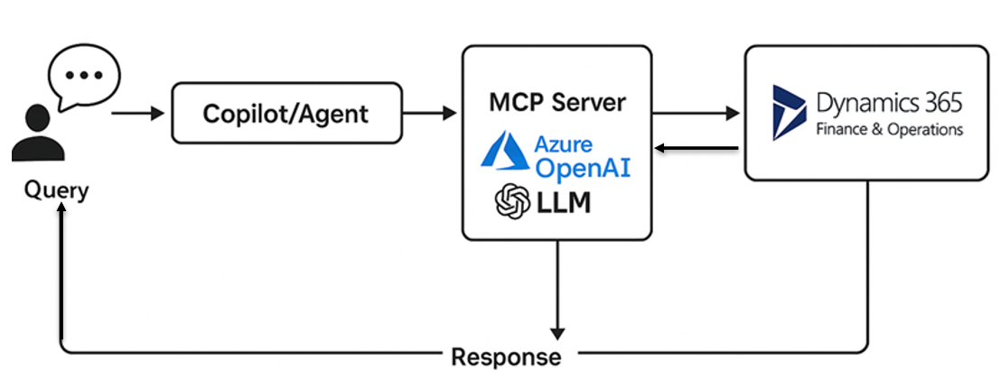

# MCP Server for Dynamics 365 Finance & Operations

This project demonstrates how to build a custom Model Context Protocol (MCP) server that integrates Azure OpenAI with Dynamics 365 Finance & Operations (D365 F&O). The server leverages natural language input to generate valid OData queries, fetch data from D365, and process results using a Large Language Model (LLM).

---

## 🔧 Architecture Overview

![Architecture Diagram]


### Components:
- **Client (User)**: Sends natural language queries.
- **MCP Server (FastAPI)**: Parses the input, uses Azure OpenAI to generate an OData query.
- **D365 F&O**: Returns matching business data using OData.
- **Azure OpenAI**: Used twice — once to generate the OData query, and again to post-process the response.
- **Output**: Cleaned and focused data returned to the calling system.

---

## 📦 Technology Stack

- Python 3.10+
- FastAPI
- Azure OpenAI (`openai` Python SDK)
- Requests (for HTTP calls)
- OAuth2 for secure access to D365 F&O

---

## 🛠 SDKs Used

- **OpenAI SDK** – For communicating with Azure OpenAI deployments.
- **Requests** – For REST API calls to D365 and token endpoints.
- **Pydantic + FastAPI** – For building the RESTful MCP interface.

---

## 🌐 Public MCP Servers (Non-Microsoft)

While this implementation is custom-built for D365 F&O, several public MCP servers exist in the ecosystem — especially for open-source or OSS-focused LLM projects:

- **LangChain MCP Examples**
- **Haystack LLM Agent Servers**
- **DSPy Agent Context Servers**
- **AutoGen Frameworks with context protocol layers**

These are usually used for document retrieval, QA systems, and autonomous agents.

---

## 📘 Example Scenario

> *"Show me top 10 customers from California with credit limit over $10,000"*

### How It Works:
1. User sends a natural language request.
2. MCP Server uses LLM to generate this OData query:

```
CustomersV3?$filter=State eq 'CA' and CreditLimit gt 10000&$top=10
```

3. MCP Server calls the D365 F&O endpoint with this query.
4. Response is then passed **back to the LLM** for post-processing to **extract just the Customer Name and ID**.
5. Final cleaned output is returned to the caller.

---

## 💡 LLM Prompting Strategy

Two distinct prompts are used:
- **Prompt #1 (Generate OData Query)** – Guides the LLM to only return a valid OData URL fragment.
- **Prompt #2 (Refine Response)** – Extracts only `CustomerAccount` and `CustomerName` from the raw OData response.

---


---

## 📂 Getting Started

1. Clone the repo.
2. Copy `.env.sample` to `.env` and fill in your keys.
3. Run the server:
```bash
uvicorn main:app --reload
```

---

## 🔐 Security

Make sure `.env` is added to `.gitignore`. Do not commit your credentials or secrets.

---

## Testing
Use CURL or tools like PostMan to send API call:
Invoke-RestMethod -Uri http://127.0.0.1:8000/api/mcp `
-Method POST `
-Body '{"name":"Test","context":"Get Customers and first only"}' `
-ContentType "application/json"

## 📄 License

MIT License
